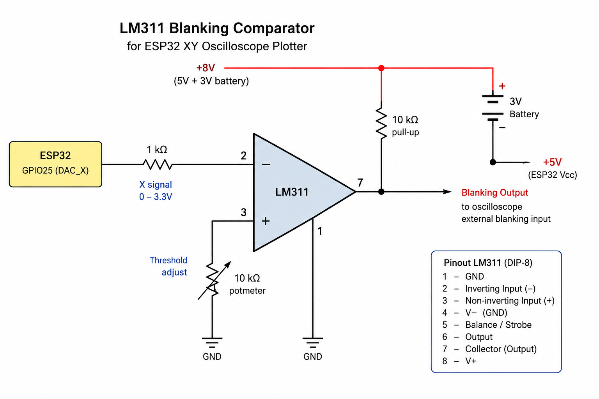

# ESP32 XY Oscilloscope Plotter

An XY vector graphics generator for the classic ESP32 using the built-in DACs and a standard analogue oscilloscope in X-Y mode.

The project demonstrates how a classic ESP32 can generate vector graphics, text, geometric figures and animated Lissajous patterns using only the two internal 8-bit DAC channels.

## Features

* DMA-driven DAC output for stable images
* Uses both ESP32 internal DACs
    * GPIO25 = X-axis
    * GPIO26 = Y-axis
* BOOT button (GPIO0) cycles through display modes
* Supports:
    * Multi-line vector text
    * Five-dot test pattern
    * Horizontal line
    * Vertical line
    * Diagonal line
    * Square
    * Circle
    * Animated Lissajous figures
* Optional hardware blanking using an LM311 comparator
* Compatible with ESP-IDF v6.0.1

## Hardware

### ESP32

Tested on:

* ESP32 DevKit V1 (30-pin)

### Oscilloscope

Any analogue oscilloscope supporting X-Y mode.

Connections:

| ESP32 | Oscilloscope |
| --- | --- |
| GPIO25 | X input |
| GPIO26 | Y input |
| GND | GND |

### Optional hardware blanking

The project can generate a blanking marker using the X DAC output.

An LM311 comparator detects X=255 and drives the oscilloscope's external blanking input.

This significantly reduces unwanted retrace lines between vector segments.

## Optional Hardware Blanking

The project supports hardware blanking using an LM311 comparator.

### LM311 Blanking Circuit

The comparator monitors the X-axis DAC output. When the software outputs X=255, the comparator activates the oscilloscope's external blanking input, suppressing retrace lines between vector segments.

The blanking threshold is adjustable using a 10 kΩ potentiometer.

## Display modes

<table><tbody><tr><td>Mode</td><td>Description</td></tr><tr><td>1</td><td>Text ("Hallo Martti!!")</td></tr><tr><td>2</td><td>Five-dot test pattern</td></tr><tr><td>3</td><td>Blanking test</td></tr><tr><td>4</td><td>Horizontal line</td></tr><tr><td>5</td><td>Vertical line</td></tr><tr><td>6</td><td>Diagonal line</td></tr><tr><td>7</td><td>Square</td></tr><tr><td>8</td><td>Circle</td></tr><tr><td>9</td><td>Animated Lissajous figure</td></tr></tbody></table>

Press the BOOT button to switch modes.

## Notes

### DMA buffer size

The ESP32 DAC continuous driver may report:

bytes_loaded = 4096

even when a larger buffer is supplied.

The software automatically adapts to the actual usable DMA size.

### Oscilloscope settings

Recommended starting point:

* X-Y mode enabled
* DC coupling
* 0.5 to 2 V/div
* Focus adjusted carefully
* Intensity kept relatively low

### Probe settings

For best results:

* Use direct BNC connections if possible
* Avoid 10× probes unless additional attenuation is required

### DAC limitations

The ESP32 DACs are only 8-bit.

This project intentionally embraces the limitations of vintage vector graphics systems and analogue oscilloscopes.

## Future ideas

* Hardware synchronized blanking
* Vector font expansion
* Additional geometric patterns
* Oscilloscope clock
* Vector game demonstrations
* Wireframe 3D objects

## License

MIT License
